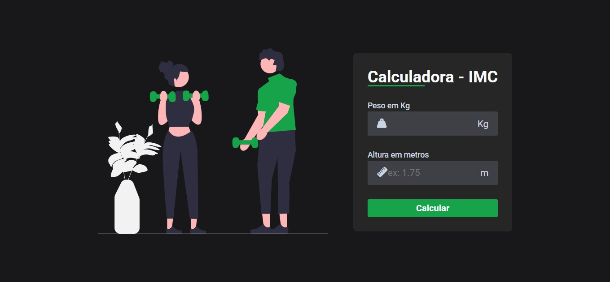

# ⚖️ Calculadora de IMC

Projeto Front-End de uma calculadora de IMC (Índice de Massa Corporal), desenvolvida para realizar cálculos a partir dos dados informados pelo usuário, exibindo o resultado de forma clara e intuitiva.

## 🖥️ Demonstração
🔗 Site online: https://calculadora-imc-umber-pi.vercel.app/  
🔗 Repositório: https://github.com/mellacer/Calculadora-IMC

## 📸 Preview


## 🛠️ Tecnologias Utilizadas
- HTML5
- CSS3
- JavaScript
- Font Awesome (ícones)

## ⚙️ Funcionalidades
- Entrada de peso e altura pelo usuário
- Cálculo automático do IMC
- Exibição do resultado com classificação
- Interface simples e intuitiva
- Uso de ícones para melhorar a experiência visual

## 📚 Objetivo do Projeto
Projeto desenvolvido com fins educacionais, com o objetivo de praticar:
- Lógica de programação com JavaScript
- Manipulação do DOM
- Tratamento de eventos e validação básica
- Integração de bibliotecas externas (Font Awesome)
- Organização de layout e usabilidade

## 📱 Responsividade
O layout foi desenvolvido para se adaptar a diferentes tamanhos de tela, garantindo uma boa experiência em dispositivos desktop e mobile.

## 🚀 Como executar o projeto
```bash
# Clone o repositório
git clone https://github.com/mellacer/Calculadora-IMC

# Acesse a pasta do projeto
cd Calculadora-IMC

# Abra o arquivo index.html no navegador
